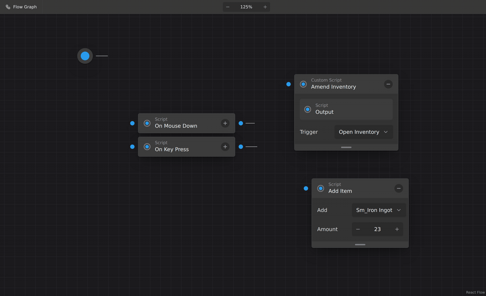
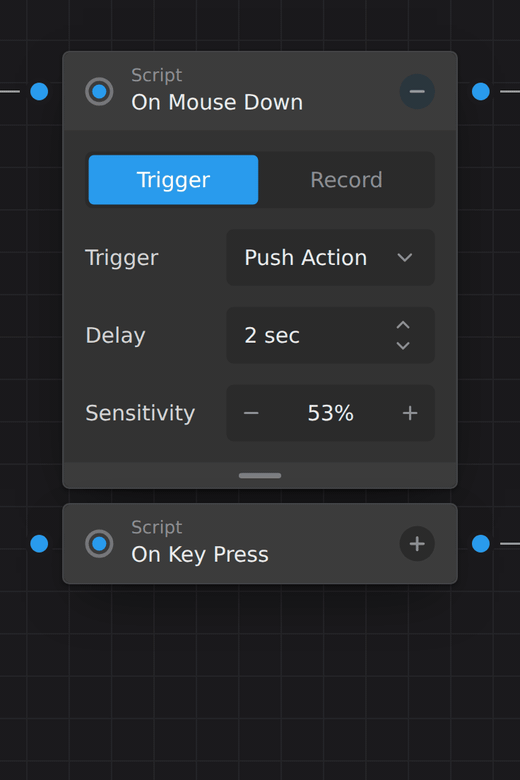
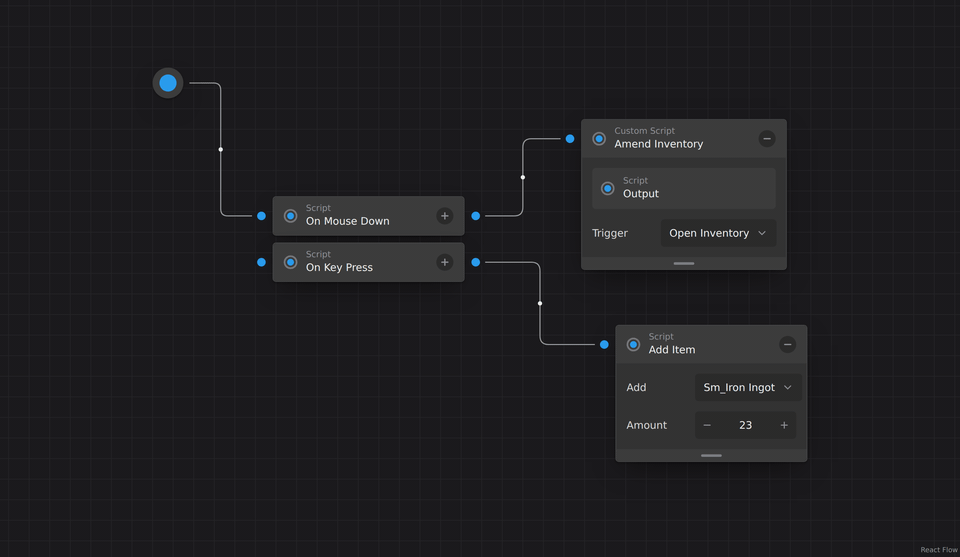

# GraphComp

Copy-paste components for node-based canvas interfaces. Built on
[React Flow](https://reactflow.dev), [Tailwind CSS](https://tailwindcss.com)
and [Motion](https://motion.dev). Distributed the
[shadcn/ui](https://ui.shadcn.com) way: you run one command and own the
source.



> **Status:** pre-release. The foundation is built and gated. The hosted
> registry is the ROADMAP item [Publish the registry](agent-kit/ROADMAP.md). Until it ships, build
> the registry locally (see [Develop](#develop)).

## See it move

Every press answers: buttons shrink on a spring and flash the accent, values
roll, the select confirms the choice before it closes. Recorded at 50 fps
from the playground with `pnpm gifs`.

<table>
  <tr>
    <td width="40%"></td>
    <td width="60%"></td>
  </tr>
  <tr>
    <td>Widgets, by mouse and keyboard</td>
    <td>Edges follow as nodes move</td>
  </tr>
</table>

## Why

React Flow gives you a fast, correct canvas. It does not give you the
nodes. Every team rebuilds the same headers, ports, collapsible bodies,
dropdowns and steppers, and most of them look like a debugging tool.
GraphComp is the missing layer: nodes and in-node widgets with the
polish of a product, that you copy into your app and change freely.

## Install

GraphComp items install with the shadcn CLI into any React project with
Tailwind CSS 4.

```sh
npx shadcn add https://thyfriendlyfox.github.io/GraphComp/r/event-flow.json
```

Then import the theme once in your global CSS:

```css
@import "tailwindcss";
@import "@xyflow/react/dist/base.css";
@import "./styles/graphcomp.css";
```

Add the `dark` class to `<html>` for the dark theme.

## Use

```tsx
import { Position, type NodeProps } from "@xyflow/react"
import {
  NodeBody,
  NodeCard,
  NodeCollapseTrigger,
  NodeField,
  NodeGrip,
  NodeHeader,
  NodeStatus,
  NodeTitle,
} from "@/components/ui/node-card"
import { NodePort } from "@/components/ui/node-port"
import { NodeStepper } from "@/components/ui/node-stepper"

export function DelayNode({ selected }: NodeProps) {
  return (
    <NodeCard selected={selected} className="w-56">
      <NodePort type="target" position={Position.Left} align="header" />
      <NodePort type="source" position={Position.Right} align="header" />
      <NodeHeader>
        <NodeStatus />
        <NodeTitle eyebrow="Timing">Delay</NodeTitle>
        <NodeCollapseTrigger />
      </NodeHeader>
      <NodeBody>
        <NodeField label="Wait">
          <NodeStepper
            aria-label="Wait"
            variant="spin"
            defaultValue={2}
            format={(v) => `${v} sec`}
          />
        </NodeField>
      </NodeBody>
      <NodeGrip />
    </NodeCard>
  )
}
```

Pass it to `FlowCanvas` as a node type, like any React Flow custom node.

## Components

| Item              | What it gives you                                                              |
| ----------------- | ------------------------------------------------------------------------------ |
| `graphcomp-theme` | `gc-*` design tokens, light and dark, and React Flow overrides                 |
| `flow-canvas`     | `FlowCanvas`, `FlowToolbar`, `FlowToolbarTab`, `FlowZoomControl`               |
| `flow-edge`       | Right-angle edge with rounded corners, draw-in animation, midpoint dot         |
| `node-port`       | Connection dot outside the node edge, centered or header-aligned               |
| `node-card`       | Node shell: header, status ring, title, collapsible body, grip, fields, panels |
| `node-segmented`  | Segmented control with a sliding selection pill                                |
| `node-select`     | Select whose list opens over its trigger and zooms with the canvas             |
| `node-stepper`    | Number stepper: `− 53% +` or `2 sec ⇅`                                         |
| `event-flow`      | Complete block: entry point, stacked triggers, script nodes                    |

Next up: per-node theming, then knob, waveform, drop zone, a sound block
and neighbour reflow. See the [roadmap](agent-kit/ROADMAP.md) for the
order and the [catalog](agent-kit/docs/CATALOG.md) for all 97
components: lists, timers, progress bars, charts, logs, editors and blocks.

## Theming

Every color is a `--gc-*` CSS variable, so you can re-theme the whole
canvas, one group of nodes, or one node. Set `--gc-accent` on a node and
its ports, pills, selects and focus rings all follow. Per-node `accent`,
`tone` and `variant` props and a `NodeSurface` slot for custom node
backgrounds (gradients, images, canvas, shaders) are next on the roadmap.
See [Theming](agent-kit/docs/THEMING.md).

Every component meets the [design quality bar](agent-kit/docs/DESIGN.md):
token-only colors, spring motion that explains layout changes, reduced
motion support, and full keyboard access with WAI-ARIA roles.

## Develop

Requires Node.js 22+ and pnpm 10+.

```sh
pnpm install
pnpm dev        # playground at http://localhost:5173
pnpm verify     # lint, typecheck, build, unit + registry tests, E2E
pnpm build      # also builds the registry JSON into public/r
pnpm gifs       # re-records the README GIFs (needs ffmpeg)
```

Motion is tested frame by frame on a frozen clock: every animation must be
smooth, must not overshoot, and must finish inside 500 ms. See
[Testing](agent-kit/docs/TESTING.md).

E2E needs Chromium: `pnpm exec playwright install chromium`, or set
`CHROMIUM_PATH` to an installed Chromium binary.

| Folder                | Holds                                                  |
| --------------------- | ------------------------------------------------------ |
| `registry/graphcomp/` | The component source that users copy                   |
| `registry.json`       | The registry manifest                                  |
| `playground/`         | Vite app for development and E2E                       |
| `tests/`, `e2e/`      | Vitest and Playwright suites                           |
| `agent-kit/`          | How work happens here: roadmap, contract, weekly cycle |

## How this project is run

GraphComp is built in weekly cycles by humans and AI agents, under the
[agent kit](agent-kit/ROUTING.md). Every feature starts as a
[roadmap](agent-kit/ROADMAP.md) item with a testable promise and ships
with its evidence. The [devlog](agent-kit/DEVLOG.md) tells the story.

Contributions are welcome. Read [CONTRIBUTING.md](CONTRIBUTING.md).

## Credits

The visual direction comes from the "Instrumental Workflows" node flow
UI concept by Ali Zafar Iqbal (2021). GraphComp is an independent
implementation and is not affiliated with the designer.

## License

[MIT](LICENSE)
